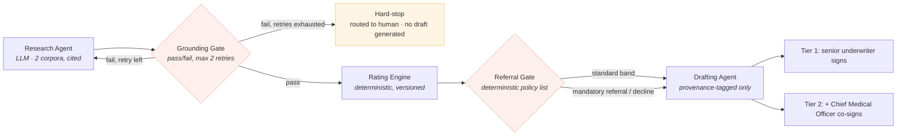

# Lumen

**A gated underwriting evidence & decision system for regulated life and health risk.**


Five gated agents, each with exactly one job, that turn a complex life or health insurance case into a fully cited evidence trail and a provenance-tagged draft decision — never an issued one. A human underwriter signs every case, every time. The system's only job is to make sure that human is working from a repeatable process instead of memory and three disconnected sources.

## The problem, in one paragraph

An underwriter handling a complex case — a serious health history, a hazardous occupation, an unusually high sum assured — assembles evidence from habit: whichever reinsurer manual they remember, a precedent pulled from a spreadsheet if anyone thought to log it, literature checked only when the case feels unusual enough to warrant it. Which sources were actually considered, and why, is rarely recorded in a form anyone could reconstruct later. That's a quiet consistency problem today. It becomes a specific legal exposure on **2 August 2026**.

## Why this domain, specifically

This isn't a system built for a regulation-shaped problem — the regulation names this exact activity. The EU AI Act's Annex III, point 5(c), classifies AI systems used for **risk assessment and pricing in relation to natural persons in life and health insurance** as high-risk, with associated obligations — documented risk management, data governance, automatic logging, transparency, human oversight, and demonstrable accuracy — becoming enforceable on 2 August 2026. Guidance from the EU AI Office indicates these obligations extend to systems already in production, not only new deployments, which makes this a live remediation question for any EU life insurer's underwriting process right now, whether or not a system like Lumen exists yet.

## Live artifact

`lumen-design-doc.html` is a self-contained, interactive living design document — no build step, no dependencies. Open it directly in a browser, or serve it via GitHub Pages. It includes:

- A full client brief, stakeholder map, and problem statement for the fictional anchor client, **NoordLeven Life & Health**
- An interactive **agent-trace simulator** — run a grounded case through to a Tier 1 draft, then run a second case where evidence is genuinely insufficient and watch the system hard-stop to a human rather than deliver a weaker draft
- The full EU AI Act obligation mapping, ADR set, and rollout roadmap referenced below

```
open lumen-design-doc.html
# or, for a shareable link:
# push to a gh-pages branch and serve via GitHub Pages
```

## Architecture

Five components. Each does exactly one job. The system produces a draft only when the evidence genuinely supports one — otherwise it stops and says so.



| Component | Type | Single responsibility |
|---|---|---|
| Research Agent | LLM | Decompose the risk question, retrieve from reinsurer guidance and internal precedent, write structured evidence with citations |
| Grounding Gate | LLM, scoring only | Pass/fail check on citation coverage and contradiction — not a multi-dimension rubric |
| Rating Engine | Deterministic | Compute premium loading from structured risk factors — the actuarial team's own versioned methodology, never touched by the LLM |
| Referral Gate | Deterministic policy check | Decide *who* must sign — never *whether* someone signs |
| Drafting Agent | LLM, template-constrained | Generate the offer or referral letter — every clause tagged to a Rating Engine output or a specific citation |

**On refusing to guess:** most comparable research-agent designs deliver the best available output after a retry cap is reached, flagged with a quality warning. Lumen deliberately does not. After two failed grounding attempts, the case hard-stops to a human with an insufficient-evidence flag — no draft at all. A regulated underwriting decision that stays ungrounded shouldn't exist in draft form; the risk of it being signed off under time pressure outweighs the convenience of having something to start from. That's the one design choice in this repository worth arguing about, and [ADR-LM-03](lumen-design-doc.html#s10) argues it directly.

## Design principles

1. **Single responsibility, always.** The Research Agent finds evidence. It does not score its own grounding, compute a premium, or decide who reviews the case.
2. **Deterministic where a wrong number is a legal problem.** The Rating Engine is plain, versioned code. An LLM never computes or adjusts a premium loading, directly or indirectly.
3. **Hard-stop over graceful degradation.** Insufficient evidence produces no draft — not a flagged, lower-confidence one.
4. **A human signs every case, without exception.** Unlike this portfolio's other agentic-commerce piece (see below), there is no pre-authorization concept in underwriting that could substitute for a human signature — so Lumen never attempts one.
5. **Observability is one log table, not a platform.** One structured event per agent invocation is enough to reconstruct any case for Article 12 — not a SIEM, not a knowledge graph, not a bespoke audit UI.

## Regulatory grounding — obligations mapped to mechanisms, not asserted

| Article | Obligation | Lumen mechanism |
|---|---|---|
| Art. 9 — Risk management | Continuous risk management across the system lifecycle | The gated graph *is* the risk surface — each gate is a testable control point |
| Art. 10 — Data governance | Reference data relevant, error-checked | Both retrieval corpora curated and versioned; precedent corpus reviewed for consistency by the actuarial team |
| Art. 12 — Record-keeping | Logging sufficient for post-hoc reconstruction | One structured event per agent run — inputs, outputs, confidence, latency |
| Art. 13 — Transparency | Meaningful explanation to the person affected | Every drafted sentence is provenance-tagged to a citation or a Rating Engine output |
| Art. 14 — Human oversight | A natural person can oversee, interpret, and override | Every case signed by an underwriter; Tier 2 is structurally non-bypassable |
| Art. 15 — Accuracy, robustness | Appropriate accuracy for a high-risk system | Rating calculation is deterministic, never LLM-derived |
| Art. 27 — FRIA | Fundamental rights impact assessment for named deployer categories, including insurers | Flagged as a required governance action item — not resolved by this architecture alone |

This table is a starting point for a conformity assessment, not a substitute for one — see the disclaimer below.

## Architecture Decision Records

Six ADRs, each with rejected alternatives named explicitly:

- **ADR-LM-01** — Five single-responsibility gated agents, not one end-to-end agent or a larger composite platform
- **ADR-LM-02** — Deterministic Rating Engine, never an LLM performing the calculation
- **ADR-LM-03** — Hard-stop to a human after failed grounding, not a lower-confidence draft
- **ADR-LM-04** — Referral Gate is a deterministic policy list, not a confidence-based decision
- **ADR-LM-05** — Provenance-tagged drafting only — no sentence exists without a citation or engine reference
- **ADR-LM-06** — One structured log table, not a three-layer audit architecture

Full rationale for each lives in [`lumen-design-doc.html`, §10](lumen-design-doc.html#s10).

## What's built vs. what's designed — stated plainly

This is a systems-design and regulatory-literacy portfolio piece, not a production deployment:

- ✅ Full architecture, ADRs, EU AI Act obligation mapping, and rollout roadmap — complete
- ✅ Interactive agent-trace simulator demonstrating both the grounded path and the hard-stop path — complete, runs client-side, no backend
- ⬜ Real retrieval against a live reinsurer-guidance or precedent corpus — not built
- ⬜ Production-grade citation verification (confirming a cited passage actually supports the claim, not just that a citation string is present) — not built
- ⬜ A completed Fundamental Rights Impact Assessment — explicitly out of scope; that's a legal deliverable, not an architectural one

The honest reason: citation verification that can't be fooled by a plausible-looking but wrong reference is a genuinely hard problem, and claiming it's solved without real adversarial testing would undercut the exact discipline this design is trying to demonstrate.

## Rollout roadmap

| Phase | Scope |
|---|---|
| **1** | Research Agent and Grounding Gate only, term life line. No Rating Engine integration, no drafting — proves evidence assembly and citation accuracy before anything touches a rating decision |
| **2** | Add Rating Engine, Referral Gate, and Drafting Agent for term life. Full case-level Art. 12 record established. FRIA determination completed with legal counsel before this phase begins |
| **3** | Extend to critical illness and income protection lines. Annex IV technical documentation assembled from Phase 1–2 evidence |

## Part of a four-project portfolio

Lumen is the third of four living design documents built on the same design system, each targeting a different regulated financial-services workflow:

| Project | Domain | Regulatory anchor |
|---|---|---|
| **SLUDGE** | Consumer Duty outcomes monitoring | UK FCA Consumer Duty |
| **Vantage** | Commercial insurance claims (FNOL) | UK FCA ICOBS |
| **Lumen** | Life & health underwriting | EU AI Act, Annex III(5)(c) |
| **Corridor** | Cross-border SME trade settlement | UK PSR · EU MiCA/AI Act · US GENIUS Act |

Lumen and Corridor intentionally diverge on one point: Lumen requires a human signature on every case; Corridor allows unattended execution strictly within a pre-authorized mandate. That's not an inconsistency across the portfolio — it's two different domains with two different legitimate sources of human authority, and both documents argue the point explicitly rather than leaving a reader to notice the gap on their own.

## Disclaimer

NoordLeven Life & Health, Anke Voss, and every named stakeholder and case reference in this repository are fictional constructs built for this portfolio piece. The EU AI Act's Annex III classification, its 2 August 2026 enforcement date, and the cited Articles (9, 10, 12, 13, 14, 15, 27) describe the real Regulation (EU) 2024/1689. Nothing here constitutes legal advice — the obligation mapping is a starting point for a real conformity assessment, prepared by qualified counsel, not a substitute for one.

## Author

Built as a portfolio artifact demonstrating applied AI systems design against a real, current, and specifically-named regulatory obligation — not a general "AI governance" gesture.

---

<sub>License: MIT. Use, adapt, or fork freely.</sub>
